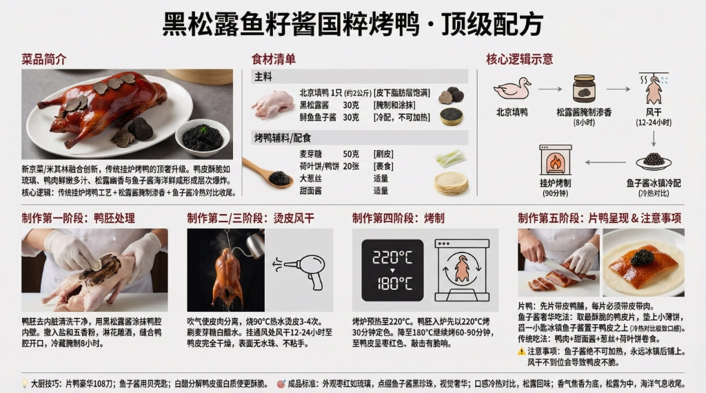
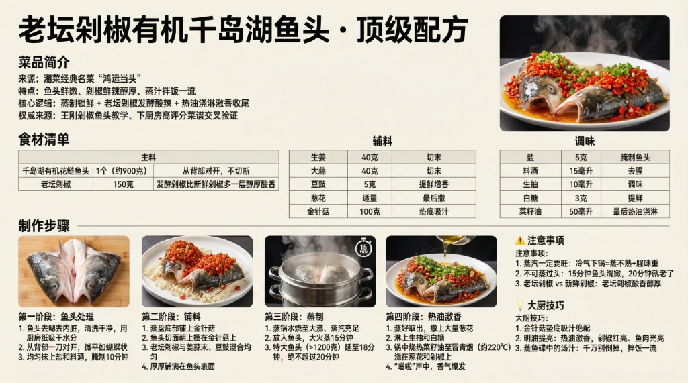
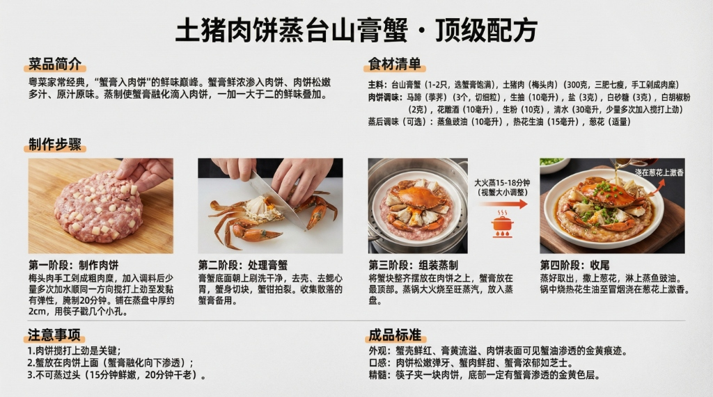
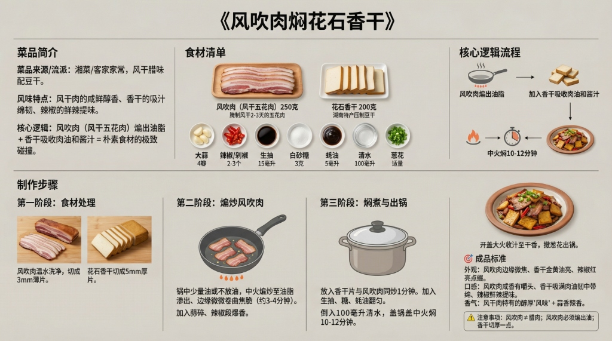
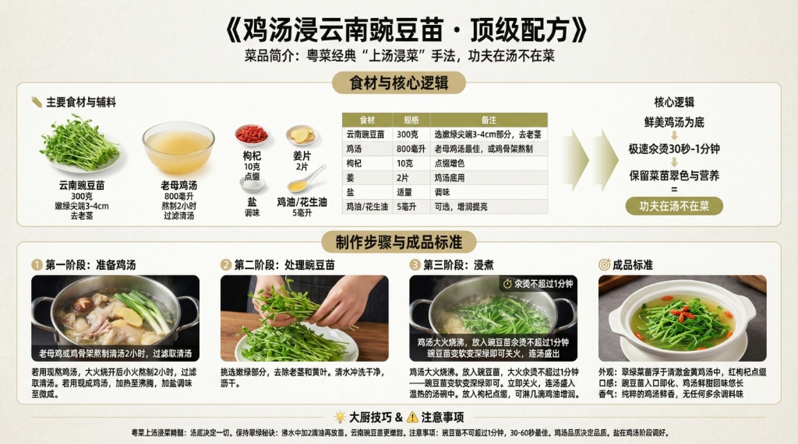

# 🧧 2026 年夜饭 · 菜谱目录

> 8-10人豪华年夜饭套餐，16道菜全套配方

---

## 📋 菜单总览

### 🔴 红红火火
| 菜品 | 配方链接 |
|------|----------|
| 精美果盘 | （水果拼盘，无需配方） |

### 🏆 前程似锦（凉菜）
| 菜品 | 配方链接 | 视觉预览 |
|------|----------|----------|
| 卤水拼盘 | [查看配方](卤水拼盘_顶级配方.md) |  |
| 泰椒浸花甲 | [查看配方](泰椒浸花甲_顶级配方.md) |  |
| 藤椒极品海蜇皇 | [查看配方](藤椒极品海蜇皇_顶级配方.md) |  |
| 青花椒野莴笋 | [查看配方](青花椒野莴笋_顶级配方.md) |  |

### 💰 财源滚滚（汤品）
| 菜品 | 配方链接 | 视觉预览 |
|------|----------|----------|
| 土茯苓麦冬炖唐排 | [查看配方](土茯苓麦冬炖唐排_顶级配方.md) |  |

### 🐴 马到成功（主菜）
| 菜品 | 配方链接 | 视觉预览 |
|------|----------|----------|
| 黑松露鱼籽酱国粹烤鸭 | [查看配方](黑松露鱼籽酱国粹烤鸭_顶级配方.md) |  |
| 鱼籽酱一口酥 | [查看配方](鱼籽酱一口酥_顶级配方.md) |  |
| 老坛剁椒有机千岛湖鱼头 | [查看配方](老坛剁椒有机千岛湖鱼头_顶级配方.md) |  |
| 波士顿龙虾爆年糕 | [查看配方](波士顿龙虾爆年糕_顶级配方.md) |  |
| 金边鲍鱼煎焗跑山鸡 | [查看配方](金边鲍鱼煎焗跑山鸡_顶级配方.md) |  |
| 土猪肉饼蒸台山膏蟹 | [查看配方](土猪肉饼蒸台山膏蟹_顶级配方.md) |  |
| 鲜焖黄牛肉 | [查看配方](鲜焖黄牛肉_顶级配方.md) |  |
| 椒麻蒜香仔排 | [查看配方](椒麻蒜香仔排_顶级配方.md) |  |
| 极品LV辣椒羊肚菌烧花猪肉 | [查看配方](极品LV辣椒羊肚菌烧花猪肉_顶级配方.md) |  |
| 风吹肉焖花石香干 | [查看配方](风吹肉焖花石香干_顶级配方.md) |  |

### 🍀 福禄双全（蔬菜）
| 菜品 | 配方链接 | 视觉预览 |
|------|----------|----------|
| 鸡汤浸云南豌豆苗 | [查看配方](鸡汤浸云南豌豆苗_顶级配方.md) |  |

---

## 🛒 食材购买清单指南

> 按采购分类整理，方便一站式采购。标注了每种食材对应的菜品，避免重复购买。

---

### 🥩 肉类

| 食材 | 总用量 | 对应菜品 |
|------|--------|----------|
| 牛腱子（金钱腱） | 300克 | 卤水拼盘 |
| 猪舌 | 1条（250克） | 卤水拼盘 |
| 猪肚 | 半个（200克） | 卤水拼盘 |
| 鸭胚（北京填鸭） | 1只（2公斤） | 黑松露鱼籽酱国粹烤鸭 |
| 跑山鸡（走地鸡） | 1只（1.5公斤） | 金边鲍鱼煎焗跑山鸡 |
| 老母鸡/鸡骨架 | 1只 | 鸡汤浸云南豌豆苗（熬汤用） |
| 土猪梅头肉 | 300克 | 土猪肉饼蒸台山膏蟹 |
| 黄牛腩 | 500克 | 鲜焖黄牛肉 |
| 猪仔排 | 500克 | 椒麻蒜香仔排 |
| 唐排（猪小排） | 400克 | 土茯苓麦冬炖唐排 |
| 花猪五花肉 | 400克 | 极品LV辣椒羊肚菌烧花猪肉 |
| 风吹肉（风干五花肉） | 250克 | 风吹肉焖花石香干 |

### 🦐 海鲜类

| 食材 | 总用量 | 对应菜品 |
|------|--------|----------|
| 波士顿龙虾 | 1只（700-900克） | 波士顿龙虾爆年糕 |
| 台山膏蟹 | 1-2只 | 土猪肉饼蒸台山膏蟹 |
| 新鲜鲍鱼 | 8只 | 金边鲍鱼煎焗跑山鸡 |
| 千岛湖花鲢鱼头 | 1个（900克） | 老坛剁椒有机千岛湖鱼头 |
| 花甲（蛤蜊） | 500克 | 泰椒浸花甲 |
| 海蜇头（海蜇皇） | 300克 | 藤椒极品海蜇皇 |
| 鲟鱼鱼子酱 | 50克（30g烤鸭+20g一口酥） | 黑松露鱼籽酱国粹烤鸭 / 鱼籽酱一口酥 |

### 🥬 蔬菜/菌菇/豆制品

| 食材 | 总用量 | 对应菜品 |
|------|--------|----------|
| 云南豌豆苗 | 300克 | 鸡汤浸云南豌豆苗 |
| 野莴笋/莴笋 | 2根（500克） | 青花椒野莴笋 |
| 金针菇 | 100克 | 老坛剁椒鱼头（垫底） |
| 西芹 | 50克 | 藤椒极品海蜇皇 |
| 洋葱 | 1个 | 鲜焖黄牛肉（半个）+ 备用 |
| 土豆 | 1个 | 鲜焖黄牛肉（可选） |
| 马蹄（荸荠） | 3个 | 土猪肉饼蒸台山膏蟹 |
| 干羊肚菌 | 30克 | 极品LV辣椒羊肚菌烧花猪肉 |
| 花石香干 | 200克 | 风吹肉焖花石香干 |
| 豆腐干 | 200克 | 卤水拼盘 |
| 年糕 | 300克 | 波士顿龙虾爆年糕 |
| 青红辣椒 | 各3-4个 | 羊肚菌烧肉 / 风吹肉等多道 |
| 红椒丝 | 少许 | 藤椒极品海蜇皇（配色） |
| 香茅 | 1根 | 泰椒浸花甲（可选，增添泰式风味） |

### 🧄 葱姜蒜等常备料

| 食材 | 建议总量 | 使用菜品 |
|------|----------|----------|
| 大蒜 | 3头（约40瓣） | 几乎每道菜都用 |
| 老姜 | 1大块（约300克） | 几乎每道菜都用 |
| 大葱 | 1把（约10根） | 卤水、龙虾、烤鸭等 |
| 小葱/香葱 | 1把 | 多道菜点缀 |
| 香菜/芫荽 | 2把 | 泰椒浸花甲、藤椒海蜇皇 |
| 鲜沙姜 | 150克 | 金边鲍鱼煎焗跑山鸡（灵魂香料） |
| 小米椒/指天椒 | 5个 | 泰椒浸花甲 |
| 红葱头 | 6粒 | 金边鲍鱼煎焗跑山鸡 |

### 🌶️ 干货/香料

| 食材 | 用量 | 对应菜品 |
|------|------|----------|
| 八角 | 5个 | 卤水拼盘 + 鲜焖黄牛肉 |
| 桂皮 | 1块 | 卤水拼盘 |
| 草果 | 2个 | 卤水拼盘 |
| 花椒粒 | 30克 | 卤水 + 青花椒莴笋 + 椒麻仔排 |
| 青花椒粒 | 20克 | 青花椒莴笋 + 椒麻仔排 |
| 香叶 | 7片 | 卤水拼盘 + 鲜焖黄牛肉 |
| 小茴香 | 4克 | 卤水拼盘 + 鲜焖黄牛肉 |
| 南姜（高良姜） | 10克 | 卤水拼盘（潮汕味） |
| 干辣椒 | 10个 | 卤水 + 莴笋 + 仔排 |
| 老坛剁椒 | 150克 | 老坛剁椒鱼头 |
| 豆豉 | 5克 | 老坛剁椒鱼头 |
| 五香粉 | 8克 | 烤鸭 + 椒麻仔排 |
| 白胡椒粉 | 5克 | 土猪肉饼蒸台山膏蟹 + 多道菜去腥 |
| 现磨黑胡椒 | 少许 | 鱼籽酱一口酥（可选） |

### 🍶 调味料/酱料

| 调料 | 建议规格 | 使用菜品 |
|------|----------|----------|
| 生抽 | 1瓶（500ml） | 几乎每道菜 |
| 老抽 | 1瓶（250ml） | 卤水、焖牛肉、烤鸭等 |
| 蒸鱼豉油 | 1瓶 | 白灼类 + 蒸蟹 |
| 蚝油 | 1瓶 | 多道菜 |
| 料酒/花雕酒 | 1瓶（500ml） | 几乎每道菜去腥 |
| 绍兴酒 | 1瓶（250ml） | 金边鲍鱼煎焗跑山鸡（可与花雕酒互替） |
| 香醋 | 1瓶 | 海蜇皇 + 莴笋 |
| 鱼露（泰国产） | 1小瓶 | 泰椒浸花甲 |
| 柱候酱 | 1罐 | 鲜焖黄牛肉（灵魂酱） |
| 甜面酱 | 1罐 | 烤鸭蘸料 |
| 藤椒油 | 1瓶 | 藤椒极品海蜇皇 |
| 菜籽油 | 1瓶 | 青花椒莴笋 + 剁椒鱼头 |
| 花生油 | 1瓶 | 蒸蟹激香 + 多道菜 |
| 芝麻油/麻油 | 1瓶 | 多道菜增香 |
| 鸡精 | 1小袋 | 青花椒野莴笋（可选） |
| 冰糖 | 100克 | 卤水 + 焖牛肉 + 羊肚菌烧肉 |
| 白砂糖 | 50克 | 多道菜提鲜 |
| 麦芽糖 | 50克 | 烤鸭上色 |
| 白醋 | 1小瓶 | 烤鸭（脆皮） |
| 马尔顿海盐 | 1罐 | 高端菜品调味 |

### 🍽️ 高端食材

| 食材 | 用量 | 对应菜品 |
|------|------|----------|
| 新鲜黑松露 | 10-15克 | 黑松露鱼籽酱国粹烤鸭（出菜装饰） |
| 黑松露酱 | 30克 | 黑松露鱼籽酱国粹烤鸭（腌制） |
| 鲟鱼鱼子酱 | 50克 | 烤鸭(30g) + 一口酥(20g) |
| 法式酸奶油 | 50克 | 鱼籽酱一口酥 |
| 飞碟酥/迷你酥皮塔壳 | 10个 | 鱼籽酱一口酥 |
| 新鲜莳萝 | 少许 | 鱼籽酱一口酥 |
| 柠檬 | 1个 | 鱼籽酱一口酥（取皮屑，可选） |

### 🥚 蛋/奶/其他

| 食材 | 用量 | 对应菜品 |
|------|------|----------|
| 鸡蛋 | 6个 | 卤水拼盘(4) + 金边鸡(半个) + 备用 |
| 荷叶饼/鸭饼 | 20张 | 烤鸭配食 |
| 枸杞 | 20克 | 炖唐排(10g) + 鸡汤浸豌豆苗(10g) |
| 红枣（去核） | 6粒 | 土茯苓麦冬炖唐排 |
| 玉米淀粉/生粉 | 100克 | 多道菜勾芡上浆 |
| 鸡油 | 少许 | 鸡汤浸云南豌豆苗（可选，增润提亮） |

### 🌿 药材

| 食材 | 用量 | 对应菜品 |
|------|------|----------|
| 鲜土茯苓 | 50克 | 土茯苓麦冬炖唐排 |
| 麦冬 | 30克 | 土茯苓麦冬炖唐排 |

### 🍑 水果

| 食材 | 用量 | 对应菜品 |
|------|------|----------|
| 青柠 | 2个 | 泰椒浸花甲（取汁） |
| 应季水果 | 适量 | 精美果盘（车厘子、草莓、蓝莓、龙眼等） |

---

## 📝 采购建议

1. **提前3天**：干货类（羊肚菌、香料包、药材、鱼子酱）和调味料可网购
2. **提前2天**：肉类（牛腱子、猪舌、猪肚需卤制浸泡过夜）、风吹肉、鸭胚（需腌制+风干24小时）
3. **提前1天**：海蜇头（需泡发4小时去咸）、花甲（需吐沙）、卤水拼盘食材（提前卤好）
4. **当天采购**：活海鲜（龙虾、膏蟹、鲍鱼——必须当天鲜活）、豌豆苗、莴笋等蔬菜
5. **全程冷链**：鱼子酱、酸奶油、黑松露需冰箱保存

---

## ⏰ 年夜饭当天出菜顺序建议

| 顺序 | 菜品 | 上菜时机 |
|------|------|----------|
| 1 | 精美果盘 | 入席即上 |
| 2 | 卤水拼盘 | 入席即上（提前切好） |
| 3 | 泰椒浸花甲 | 入席即上（提前冷浸好） |
| 4 | 藤椒极品海蜇皇 | 入席即上 |
| 5 | 青花椒野莴笋 | 入席即上 |
| 6 | 鱼籽酱一口酥 | 凉菜后即上 |
| 7 | 土茯苓麦冬炖唐排 | 热菜前上（提前炖好） |
| 8 | 黑松露鱼籽酱国粹烤鸭 | 第一道主角 |
| 9 | 老坛剁椒鱼头 | 紧接烤鸭 |
| 10 | 波士顿龙虾爆年糕 | 海鲜主打 |
| 11 | 金边鲍鱼煎焗跑山鸡 | 硬菜 |
| 12 | 土猪肉饼蒸台山膏蟹 | 硬菜 |
| 13 | 鲜焖黄牛肉 | 硬菜（可提前焖好加热） |
| 14 | 椒麻蒜香仔排 | 硬菜 |
| 15 | 极品LV辣椒羊肚菌烧花猪肉 | 硬菜 |
| 16 | 风吹肉焖花石香干 | 家常压轴 |
| 17 | 鸡汤浸云南豌豆苗 | 最后清口 |
