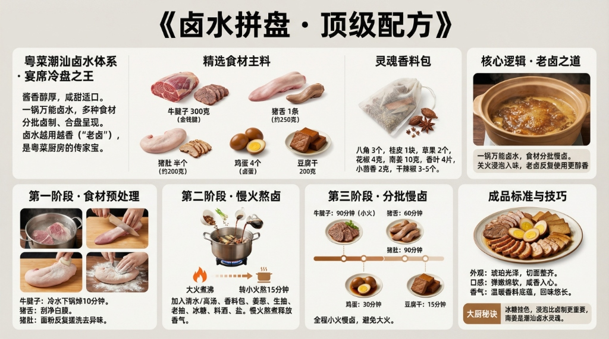

# 《卤水拼盘》顶级配方



## 菜品简介

- **菜品来源/流派**：粤菜/潮汕卤水体系，宴席冷盘之王
- **风味特点**：酱香醇厚、咸甜适口、卤香四溢、食材多样
- **核心逻辑**：一锅万能卤水，多种食材分批卤制、合盘呈现。卤水越用越香（"老卤"），是粤菜厨房的传家宝

---

## 食材清单

### 主料（任选3-5种组合）
| 食材 | 规格 | 备注 |
|------|------|------|
| 牛腱子 | 300克 | 金钱腱最佳，筋肉交错、切片纹路漂亮 |
| 猪舌 | 1条（约250克） | 焯水后刮干净表皮 |
| 猪肚 | 半个（约200克） | 面粉+油反复搓洗去异味 |
| 鸡蛋 | 4个 | 煮熟去壳，卤后浸泡过夜更入味 |
| 豆腐干 | 200克 | 卤汁关火后放入，浸泡入味 |

### 卤水配方（基础版，约2500ml）
| 食材 | 用量 | 备注 |
|------|------|------|
| 清水（或猪骨高汤） | 2500毫升 | 高汤底更鲜 |
| 生抽 | 50毫升 | 提鲜调味 |
| 老抽 | 30毫升 | 上色 |
| 冰糖 | 30克 | 提亮增色 |
| 料酒 | 15毫升 | 去腥 |
| 盐 | 40克 | 根据食材量调整 |

### 卤料包（纱布包扎）
| 香料 | 用量 | 备注 |
|------|------|------|
| 八角 | 3个 | 卤水主香 |
| 桂皮 | 1块（约5克） | 增加温暖底香 |
| 草果 | 2个 | 拍碎，去膻增香 |
| 花椒 | 4克 | 微麻提味 |
| 香叶 | 4片 | 辅助增香 |
| 小茴香 | 2克 | 回甘提鲜 |
| 干辣椒 | 3-5个 | 可选，微辣提味 |
| 南姜（高良姜） | 10克 | 潮汕卤水特色 |

---

## 制作步骤

### 第一阶段：食材预处理
1. **牛腱子**：冷水下锅焯水10分钟，撇浮沫，捞出温水冲净。
2. **猪舌**：冷水下锅煮5分钟，捞出后用刀刮净白膜。
3. **猪肚**：面粉+食用油反复搓揉3次，冲洗后冷水焯煮10分钟。
4. **鸡蛋**：煮熟去壳备用。

### 第二阶段：熬制卤水
1. 所有香料用纱布扎好，提前浸泡30分钟。
2. 锅中加入清水/高汤，放入卤料包、姜片（3片）、葱段（2段）。
3. 加入生抽、老抽、冰糖、料酒、盐。
4. 大火煮沸后转小火熬15分钟，让香料充分释放。

### 第三阶段：分批卤制
| 食材 | 卤制时间 | 备注 |
|------|----------|------|
| 牛腱子 | 90分钟（小火） | 筷子能插入即熟，关火浸泡2小时更入味 |
| 猪舌 | 60分钟 | 同上 |
| 猪肚 | 90分钟 | 至筷子能轻松穿透 |
| 鸡蛋 | 30分钟卤 + 浸泡过夜 | 关火后留在卤汁里 |
| 豆腐干 | 15分钟卤 + 浸泡1小时 | 最后卤，吸满汤汁 |

### 第四阶段：切盘摆盘
1. 卤好的食材放凉后切片：牛腱切3mm薄片、猪舌斜切片、猪肚切条、鸡蛋对半切。
2. 分区摆盘，淋少许卤汁增亮。

---

## ⚠️ 注意事项

1. **卤水不可大火沸煮**：全程小火慢卤，大火会使汤浑浊、肉质发柴。
2. **老卤保存**：卤水煮沸5分钟杀菌，过滤残渣，冷却后冰箱保存，可反复使用。每次使用前补充适量盐和香料。
3. **不同食材分批卤**：避免串味，先卤牛腱（味淡），最后卤内脏。

---

## 💡 大厨技巧

1. **冰糖的妙用**：冰糖比白糖更能让卤水产生"挂色"效果——卤好的食材表面有诱人的琥珀光泽。
2. **浸泡比卤制更重要**：很多食材（尤其鸡蛋和豆干）真正入味是在关火后的浸泡阶段，建议至少浸泡2小时。
3. **南姜是潮汕卤水的灵魂**：比生姜多一份芳香辛辣，是区别普通卤水和潮汕卤水的关键。

---

## 🎯 成品标准

- **外观**：每种食材切面整齐，色泽深褐油亮，有琥珀般的卤色光泽。
- **口感**：牛腱弹嫩、猪舌绵软、猪肚爽脆、鸡蛋咸香入心。
- **香气**：八角桂皮的温暖香料味为底，回味悠长。

---

# 生图提示词（风格C · 现代写实风）

```
A modern, realistic culinary infographic poster,
presenting the complete professional recipe of
《卤水拼盘 · 顶级配方》.

OVERALL STYLE:
High-end modern culinary editorial combined with professional cooking instruction.
Clean, precise, realistic, restrained.
Feels like a culinary institute teaching board or Michelin test kitchen manual.
Educational clarity is the primary goal.

LANGUAGE & TEXT QUALITY (ABSOLUTE PRIORITY):
All text must be in standard simplified Chinese only.
High-definition, print-quality Chinese characters.
No traditional Chinese.
No misspellings.
No incorrect or distorted characters.
No pseudo-text.

IMPORTANT TEXT RULES:
All text must be rendered as natural printed book text.
Do NOT display any markdown symbols or formatting characters.
Do NOT show characters such as:
#, ##, ###, -, *, |, >, ``` or bullet symbols.
Section hierarchy must be expressed through layout, spacing, font size, and alignment only.

If needed, rewrite structured content into clean natural language paragraphs or aligned tables.

BACKGROUND:
Clean neutral background with subtle texture
(light warm gray or off-white).
Soft even studio lighting.
No patterns, no decorative backgrounds.
High contrast for long readable text.

TYPOGRAPHY:
Main title in modern, bold, highly legible Chinese typography.
Section titles in slightly larger or heavier font weight.
Body text in clean professional Chinese type.
Comfortable line spacing for dense instructional content.
Tables must be clean, aligned, and grid-based without ASCII characters.

LAYOUT STRUCTURE (CRITICAL):
Aspect ratio 16:9.
Double-row horizontal layout with clear blank space separating rows.
Strict grid system.
Visual separation achieved through spacing and alignment, not symbols.

UPPER ROW CONTENT (VISUAL SECTIONS):
Introduction: 粤菜潮汕卤水体系，宴席冷盘之王，酱香醇厚、咸甜适口.
Ingredients: 牛腱子300g、猪舌250g、猪肚200g、卤蛋4个、豆腐干200g.
Spice bag: 八角3个、桂皮1块、草果2个、花椒4g、南姜10g.
Core Logic: 一锅万能卤水分批卤制，老卤越用越香.

LOWER ROW CONTENT (VISUAL SECTIONS):
Step 1: 食材分批焯水预处理，牛腱冷水下锅焯10分钟.
Step 2: 小火慢卤，牛腱90分钟、猪舌60分钟、猪肚90分钟.
Step 3: 关火浸泡2小时以上深度入味，鸡蛋浸泡过夜.
Standard: 琥珀光泽、切面整齐、八角桂皮温暖底香悠长.

IMAGERY (REALISTIC, EDUCATIONAL):
High-quality realistic food photography:
glossy sliced beef shank revealing tendon "money coin" pattern,
assorted braised items arranged on white ceramic plate,
dark amber braising liquid simmering in clay pot,
spice bundle with star anise and cinnamon bark visible.
Images must support understanding, not distract.

GRAPHIC ELEMENTS (FUNCTIONAL ONLY):
Minimal modern diagrams:
time indicators (90min, 60min, 30min for different items),
heat level markers (small fire icon),
process flow arrows.
Flat, technical style.
No decorative icons.

COLOR SYSTEM:
Neutral professional palette:
black, dark gray, warm gray, off-white.
One warm amber accent color for emphasis only.
No bright or playful colors.

STRICT EXCLUSIONS:
No markdown characters.
No bullet symbols.
No decorative-only graphics.
No cultural motifs.
No cluttered collage.
No illegible characters.

FINAL RULE:
Render the content exactly like a professionally typeset cookbook page,
not a markdown document or note file.

--ar 16:9 --v 6.1 --q 2 高清简体中文
```
