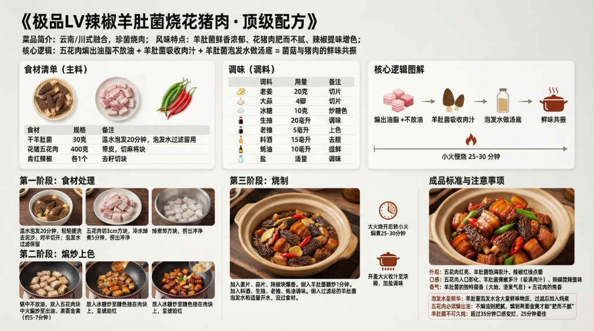

# 《极品LV辣椒羊肚菌烧花猪肉》顶级配方



## 菜品简介
- **菜品来源/流派**：云南/川式融合，珍菌烧肉
- **风味特点**：羊肚菌鲜香浓郁、花猪肉肥而不腻、辣椒提味增色
- **核心逻辑**：五花肉煸出油脂 + 羊肚菌吸收肉汁 = 菌菇与猪肉的鲜味共振

---

## 食材清单
### 主料
| 食材 | 规格 | 备注 |
|------|------|------|
| 干羊肚菌 | 30克 | 温水泡发20分钟，泡发水过滤留用 |
| 花猪五花肉 | 400克 | 带皮，切麻将块 |
| 青红辣椒 | 各1个 | 去籽切块 |

### 调味
| 调料 | 用量 | 备注 |
|------|------|------|
| 老姜 | 20克 | 切片 |
| 大蒜 | 4瓣 | 切片 |
| 冰糖 | 10克 | 炒糖色 |
| 生抽 | 20毫升 | 调味 |
| 老抽 | 5毫升 | 上色 |
| 料酒 | 15毫升 | 去膻 |
| 蚝油 | 10毫升 | 提鲜 |
| 盐 | 适量 | 调味 |

---

## 制作步骤

### 第一阶段：食材处理
1. 干羊肚菌**温水泡发20分钟**，轻轻搓洗去泥沙，对半切开。**泡发水过滤保留**。
2. 五花肉切3cm方块，冷水焯煮5分钟，捞出冲净。

### 第二阶段：煸炒上色
1. 锅中**不放油**，放入五花肉块中小火煸炒。
2. 煸至**出油、表面金黄**（约5-7分钟）。
3. 放入冰糖炒至糖色挂在肉块上，呈琥珀红。

### 第三阶段：烧制
1. 加入姜片、蒜片、辣椒块爆香。
2. 倒入羊肚菌翻炒1分钟。
3. 加入料酒、生抽、老抽、蚝油调味。
4. 倒入过滤后的**羊肚菌泡发水**和适量开水，没过食材。
5. 大火烧开后转**小火焖煮25-30分钟**。
6. 开盖大火收汁至浓稠，加盐调味。

---

## ⚠️ 注意事项
1. **泡发水是精华**：羊肚菌泡发水含大量鲜味物质（谷氨酸），倒掉等于扔掉一半鲜味。过滤后加入炖煮。
2. **五花肉必须煸出油**：不煸油的五花肉肥腻到无法下咽。煸到两面金黄才能做到"肥而不腻"。
3. **羊肚菌不可久炖**：超过35分钟口感变烂变面，25分钟最佳。

---

## 🎯 成品标准
- **外观**：五花肉红亮、羊肚菌饱满吸汁、辣椒红绿点缀。
- **口感**：五花肉入口即化、羊肚菌弹嫩多汁（吸满肉汁）、辣椒微辣提味。
- **香气**：羊肚菌的独特菌香（大地、坚果气息）+ 五花肉的焦香。

---

# 生图提示词（风格C · 现代写实风）

```
A modern, realistic culinary infographic poster,
presenting the complete professional recipe of
《极品LV辣椒羊肚菌烧花猪肉 · 顶级配方》.

OVERALL STYLE:
High-end modern culinary editorial combined with professional cooking instruction.
Clean, precise, realistic, restrained.
Feels like a culinary institute teaching board or Michelin test kitchen manual.
Educational clarity is the primary goal.

LANGUAGE & TEXT QUALITY (ABSOLUTE PRIORITY):
All text must be in standard simplified Chinese only.
High-definition, print-quality Chinese characters.
No traditional Chinese. No misspellings. No incorrect or distorted characters. No pseudo-text.

IMPORTANT TEXT RULES:
All text must be rendered as natural printed book text.
Do NOT display any markdown symbols or formatting characters.
Do NOT show characters such as: #, ##, ###, -, *, |, >, ``` or bullet symbols.
Section hierarchy must be expressed through layout, spacing, font size, and alignment only.
If needed, rewrite structured content into clean natural language paragraphs or aligned tables.

BACKGROUND:
Clean neutral background with subtle texture (light warm gray or off-white).
Soft even studio lighting. No patterns, no decorative backgrounds. High contrast for long readable text.

TYPOGRAPHY:
Main title in modern, bold, highly legible Chinese typography.
Section titles in slightly larger or heavier font weight.
Body text in clean professional Chinese type.
Comfortable line spacing for dense instructional content.
Tables must be clean, aligned, and grid-based without ASCII characters.

LAYOUT STRUCTURE (CRITICAL):
Aspect ratio 16:9. Double-row horizontal layout with clear blank space separating rows.
Strict grid system. Visual separation achieved through spacing and alignment, not symbols.

UPPER ROW CONTENT (VISUAL SECTIONS):
Introduction: 云南/川式融合珍菌烧肉，羊肚菌鲜香、花猪肉肥而不腻.
Ingredients: 干羊肚菌30g、花猪五花肉400g、青红辣椒各1个、冰糖10g.
Core Logic: 五花肉煸出油脂不放油 + 羊肚菌泡发水做汤底 + 小火慢烧25-30分钟.

LOWER ROW CONTENT (VISUAL SECTIONS):
Step 1: 干羊肚菌温水泡发20分钟，泡发水过滤留用.
Step 2: 五花肉不放油煸至金黄出油，冰糖炒至琥珀色.
Step 3: 加羊肚菌和泡发水，小火焖煮25-30分钟.
Standard: 五花肉红亮入口即化、羊肚菌弹嫩吸满肉汁、菌香+焦香.

IMAGERY (REALISTIC, EDUCATIONAL):
High-quality realistic food photography:
glossy pork belly cubes with plump morel mushrooms,
honeycomb-textured morels nestled between caramelized meat,
red and green chili pieces as accent,
thick amber sauce in clay pot.
Images must support understanding, not distract.

GRAPHIC ELEMENTS (FUNCTIONAL ONLY):
Minimal modern diagrams: time indicators (20min soak, 25-30min braise), heat level markers (small fire icon), process flow arrows. Flat, technical style. No decorative icons.

COLOR SYSTEM:
Neutral professional palette: black, dark gray, warm gray, off-white.
One deep amber-red accent color for emphasis only. No bright or playful colors.

STRICT EXCLUSIONS:
No markdown characters. No bullet symbols. No decorative-only graphics. No cultural motifs. No cluttered collage. No illegible characters.

FINAL RULE:
Render the content exactly like a professionally typeset cookbook page, not a markdown document or note file.

--ar 16:9 --v 6.1 --q 2 高清简体中文
```
