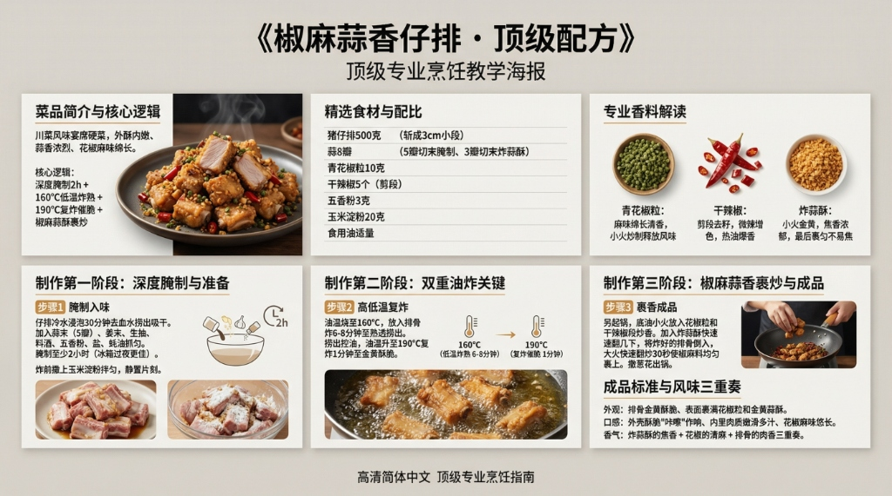

# 《椒麻蒜香仔排》顶级配方



## 菜品简介
- **菜品来源/流派**：川菜风味，宴席硬菜
- **风味特点**：外酥内嫩、蒜香浓烈、花椒麻味绵长
- **核心逻辑**：排骨深度腌制入味 + 高温炸出酥壳 + 椒麻蒜蓉二次裹香

---

## 食材清单
### 主料
| 食材 | 规格 | 备注 |
|------|------|------|
| 猪仔排 | 500克 | 斩成3cm小段 |

### 腌制料
| 调料 | 用量 | 备注 |
|------|------|------|
| 大蒜 | 8瓣 | 5瓣切末腌制、3瓣切末炸蒜酥 |
| 姜末 | 10克 | 去腥 |
| 生抽 | 20毫升 | 底味 |
| 料酒 | 15毫升 | 去腥 |
| 五香粉 | 3克 | 增香 |
| 盐 | 5克 | 入味 |
| 蚝油 | 10毫升 | 提鲜 |
| 玉米淀粉 | 20克 | 裹粉炸酥 |

### 椒麻料
| 调料 | 用量 | 备注 |
|------|------|------|
| 花椒粒 | 10克 | 青花椒更佳 |
| 干辣椒 | 5个 | 剪段 |
| 炸蒜酥 | 20克 | 蒜末小火炸至金黄 |
| 葱花 | 适量 | 点缀 |
| 食用油 | 适量 | 油炸用 |

---

## 制作步骤

### 第一阶段：腌制
1. 仔排斩块，冷水浸泡30分钟去血水，捞出吸干。
2. 加入蒜末、姜末、生抽、料酒、五香粉、盐、蚝油抓匀。
3. **腌制至少2小时**（冰箱过夜更佳）。
4. 炸前撒上玉米淀粉拌匀。

### 第二阶段：炸排骨
1. 油温烧至**160°C**，放入排骨炸6-8分钟至熟透。
2. 捞出控油，油温升至**190°C**复炸1分钟至金黄酥脆。

### 第三阶段：椒麻蒜香裹炒
1. 另起锅，少量底油，**小火**放入花椒粒和干辣椒段炒香。
2. 加入炸蒜酥，快速翻几下。
3. 将炸好的排骨倒入，**大火快速翻炒30秒**使椒麻料均匀裹上。
4. 撒葱花出锅。

---

## ⚠️ 注意事项
1. **二次复炸是酥脆关键**：第一次低温炸熟，第二次高温逼出水分催脆。
2. **花椒小火炒、大火必焦**：花椒一焦就只剩苦味没有麻香。
3. **蒜酥最后放**：炸蒜酥非常容易焦，与排骨混合时间不超过30秒。

---

## 🎯 成品标准
- **外观**：排骨金黄酥脆、表面裹满花椒粒和金黄蒜酥。
- **口感**：外壳酥脆"咔嚓"作响、内里肉质嫩滑多汁、花椒麻味悠长。
- **香气**：炸蒜酥的焦香 + 花椒的清麻 + 排骨的肉香三重奏。

---

# 生图提示词（风格C · 现代写实风）

```
A modern, realistic culinary infographic poster,
presenting the complete professional recipe of
《椒麻蒜香仔排 · 顶级配方》.

OVERALL STYLE:
High-end modern culinary editorial combined with professional cooking instruction.
Clean, precise, realistic, restrained.
Feels like a culinary institute teaching board or Michelin test kitchen manual.
Educational clarity is the primary goal.

LANGUAGE & TEXT QUALITY (ABSOLUTE PRIORITY):
All text must be in standard simplified Chinese only.
High-definition, print-quality Chinese characters.
No traditional Chinese. No misspellings. No incorrect or distorted characters. No pseudo-text.

IMPORTANT TEXT RULES:
All text must be rendered as natural printed book text.
Do NOT display any markdown symbols or formatting characters.
Do NOT show characters such as: #, ##, ###, -, *, |, >, ``` or bullet symbols.
Section hierarchy must be expressed through layout, spacing, font size, and alignment only.
If needed, rewrite structured content into clean natural language paragraphs or aligned tables.

BACKGROUND:
Clean neutral background with subtle texture (light warm gray or off-white).
Soft even studio lighting. No patterns, no decorative backgrounds. High contrast for long readable text.

TYPOGRAPHY:
Main title in modern, bold, highly legible Chinese typography.
Section titles in slightly larger or heavier font weight.
Body text in clean professional Chinese type.
Comfortable line spacing for dense instructional content.
Tables must be clean, aligned, and grid-based without ASCII characters.

LAYOUT STRUCTURE (CRITICAL):
Aspect ratio 16:9. Double-row horizontal layout with clear blank space separating rows.
Strict grid system. Visual separation achieved through spacing and alignment, not symbols.

UPPER ROW CONTENT (VISUAL SECTIONS):
Introduction: 川菜风味宴席硬菜，外酥内嫩、蒜香浓烈、花椒麻味绵长.
Ingredients: 猪仔排500g、蒜8瓣、青花椒粒10g、干辣椒5个、五香粉3g.
Core Logic: 深度腌制2h + 160°C低温炸熟 + 190°C复炸催脆 + 椒麻蒜酥裹炒.

LOWER ROW CONTENT (VISUAL SECTIONS):
Step 1: 仔排腌制2小时（生抽+料酒+五香粉+蒜末），炸前裹玉米淀粉.
Step 2: 160°C炸6-8分钟熟透，190°C复炸1分钟至酥脆金黄.
Step 3: 小火炒花椒干辣椒出麻香，加蒜酥，倒入排骨大火翻炒30秒裹匀.
Standard: 金黄酥脆"咔嚓"作响、花椒麻味悠长、炸蒜焦香三重奏.

IMAGERY (REALISTIC, EDUCATIONAL):
High-quality realistic food photography:
golden fried pork ribs coated with Sichuan peppercorns and crispy garlic,
dried red chili segments scattered on top,
dark plate on neutral background,
cross-section showing juicy interior.
Images must support understanding, not distract.

GRAPHIC ELEMENTS (FUNCTIONAL ONLY):
Minimal modern diagrams: temperature markers (160°C→190°C), time indicators (2h marinate, 6-8min fry), process flow arrows. Flat, technical style. No decorative icons.

COLOR SYSTEM:
Neutral professional palette: black, dark gray, warm gray, off-white.
One warm amber accent color for emphasis only. No bright or playful colors.

STRICT EXCLUSIONS:
No markdown characters. No bullet symbols. No decorative-only graphics. No cultural motifs. No cluttered collage. No illegible characters.

FINAL RULE:
Render the content exactly like a professionally typeset cookbook page, not a markdown document or note file.

--ar 16:9 --v 6.1 --q 2 高清简体中文
```
