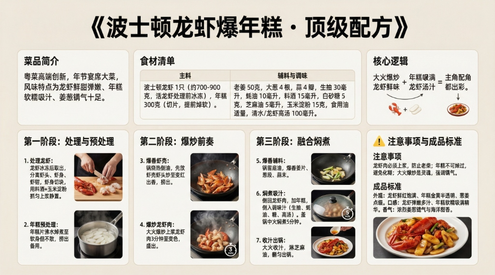

# 《波士顿龙虾爆年糕》顶级配方



## 菜品简介
- **菜品来源/流派**：粤菜高端创新，年节宴席大菜
- **风味特点**：龙虾鲜甜弹嫩、年糕软糯吸汁、姜葱镬气十足
- **核心逻辑**：大火爆炒锁住龙虾鲜味 + 年糕吸满龙虾汤汁 = 主角配角都出彩

---

## 食材清单
### 主料
| 食材 | 规格 | 备注 |
|------|------|------|
| 波士顿龙虾 | 1只（约700-900克） | 活龙虾，处理前冰冻15分钟使其安静 |
| 年糕 | 300克 | 切片，提前焯软 |

### 辅料与调味
| 调料 | 用量 | 备注 |
|------|------|------|
| 老姜 | 50克 | 切片 |
| 大葱 | 4根 | 切段 |
| 蒜 | 4瓣 | 切末 |
| 生抽 | 30毫升 | 调味 |
| 蚝油 | 10毫升 | 提鲜 |
| 料酒 | 15毫升 | 去腥 |
| 白砂糖 | 5克 | 提鲜 |
| 芝麻油 | 5毫升 | 增香 |
| 玉米淀粉 | 15克 | 龙虾肉上浆锁水 |
| 食用油 | 适量 | 爆炒用 |
| 清水/龙虾高汤 | 100毫升 | 焖年糕用 |

---

## 制作步骤

### 第一阶段：处理龙虾
1. 龙虾冰冻15分钟后取出，快速从头部一刀处理。
2. 分离虾头、虾身、虾钳。虾身剪开壳取肉，切成大块。
3. 虾肉用料酒+玉米淀粉抓匀上浆，静置10分钟。
4. 虾头虾壳留用（可熬高汤提鲜）。

### 第二阶段：年糕预处理
1. 年糕片放入沸水中焯煮至**软身但不散**（约2分钟），捞出备用。

### 第三阶段：爆炒
1. 锅烧至冒烟，倒入多量油。
2. 先放虾壳虾头炒至变红出香，捞出。
3. 放入上浆的龙虾肉块，**大火爆炒3分钟**至变色，盛出。
4. 锅中留底油，放入姜片、葱段、蒜末爆香。
5. 倒回龙虾肉，加入年糕片翻炒。
6. 加入生抽、蚝油、白砂糖、龙虾高汤/清水。
7. **盖锅盖中火焖煮5分钟**，让年糕充分吸汁。
8. 大火收汁，淋芝麻油，翻匀出锅。

---

## ⚠️ 注意事项
1. **龙虾肉必须上浆**：不上浆直接爆炒，龙虾肉会老柴失水。
2. **年糕不可焯过**：太软会焖煮时化成糊。只需焯到手按能微弯即可。
3. **大火爆炒是灵魂**：粤菜讲"镬气"——锅够热、油够多、翻炒够快，才有焦香。

---

## 🎯 成品标准
- **外观**：龙虾鲜红饱满、年糕金黄半透明、葱姜点缀。
- **口感**：龙虾弹嫩多汁、年糕软糯吸满龙虾精华汤汁。
- **香气**：浓烈的姜葱镬气 + 龙虾的海洋甜香。

---

# 生图提示词（风格C · 现代写实风）

```
A modern, realistic culinary infographic poster,
presenting the complete professional recipe of
《波士顿龙虾爆年糕 · 顶级配方》.

OVERALL STYLE:
High-end modern culinary editorial combined with professional cooking instruction.
Clean, precise, realistic, restrained.
Feels like a culinary institute teaching board or Michelin test kitchen manual.
Educational clarity is the primary goal.

LANGUAGE & TEXT QUALITY (ABSOLUTE PRIORITY):
All text must be in standard simplified Chinese only.
High-definition, print-quality Chinese characters.
No traditional Chinese. No misspellings. No incorrect or distorted characters. No pseudo-text.

IMPORTANT TEXT RULES:
All text must be rendered as natural printed book text.
Do NOT display any markdown symbols or formatting characters.
Do NOT show characters such as: #, ##, ###, -, *, |, >, ``` or bullet symbols.
Section hierarchy must be expressed through layout, spacing, font size, and alignment only.
If needed, rewrite structured content into clean natural language paragraphs or aligned tables.

BACKGROUND:
Clean neutral background with subtle texture (light warm gray or off-white).
Soft even studio lighting. No patterns, no decorative backgrounds. High contrast for long readable text.

TYPOGRAPHY:
Main title in modern, bold, highly legible Chinese typography.
Section titles in slightly larger or heavier font weight.
Body text in clean professional Chinese type.
Comfortable line spacing for dense instructional content.
Tables must be clean, aligned, and grid-based without ASCII characters.

LAYOUT STRUCTURE (CRITICAL):
Aspect ratio 16:9. Double-row horizontal layout with clear blank space separating rows.
Strict grid system. Visual separation achieved through spacing and alignment, not symbols.

UPPER ROW CONTENT (VISUAL SECTIONS):
Introduction: 粤菜高端创新，年节宴席大菜，姜葱镬气十足.
Ingredients: 波士顿龙虾1只700-900g、年糕300g、姜50g、大葱4根、蒜末.
Core Logic: 龙虾上浆锁水 + 大火爆炒镬气 + 年糕吸满龙虾汤汁.

LOWER ROW CONTENT (VISUAL SECTIONS):
Step 1: 龙虾取肉切块，料酒+玉米淀粉上浆，年糕焯软.
Step 2: 龙虾壳头先炒出香，再爆炒龙虾肉3分钟.
Step 3: 姜葱蒜爆香，加年糕和调味汁，盖锅焖5分钟吸汁.
Standard: 龙虾鲜红弹嫩、年糕金黄吸满精华、姜葱镬气浓烈.

IMAGERY (REALISTIC, EDUCATIONAL):
High-quality realistic food photography:
vibrant red lobster pieces with golden rice cake slices,
ginger slices and scallion segments visible,
dramatic steam rising from sizzling wok,
glossy sauce coating ingredients.
Images must support understanding, not distract.

GRAPHIC ELEMENTS (FUNCTIONAL ONLY):
Minimal modern diagrams: time indicators (3min stir-fry, 5min braise), heat level markers (high fire icon), process flow arrows. Flat, technical style. No decorative icons.

COLOR SYSTEM:
Neutral professional palette: black, dark gray, warm gray, off-white.
One warm red accent color for emphasis only. No bright or playful colors.

STRICT EXCLUSIONS:
No markdown characters. No bullet symbols. No decorative-only graphics. No cultural motifs. No cluttered collage. No illegible characters.

FINAL RULE:
Render the content exactly like a professionally typeset cookbook page, not a markdown document or note file.

--ar 16:9 --v 6.1 --q 2 高清简体中文
```
