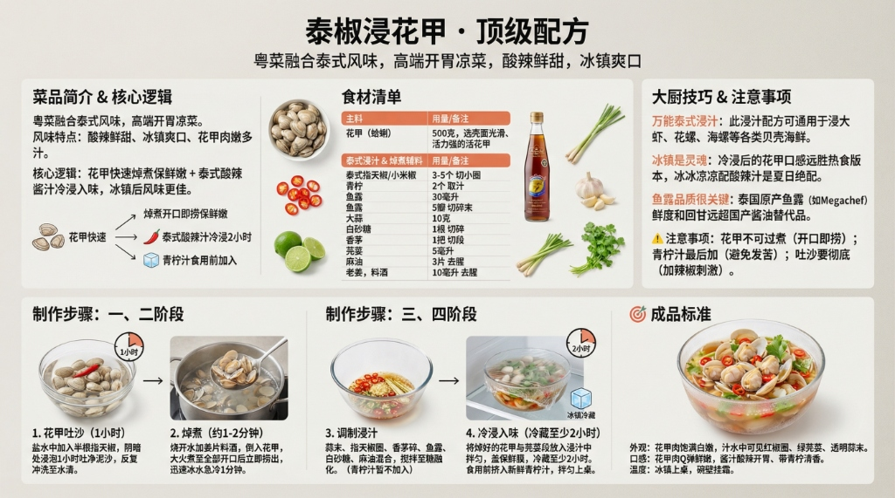

# 《泰椒浸花甲》顶级配方



## 菜品简介

- **菜品来源/流派**：粤菜融合泰式风味，高端开胃凉菜
- **风味特点**：酸辣鲜甜、冰镇爽口、花甲肉嫩多汁
- **核心逻辑**：花甲快速焯煮保鲜嫩 + 泰式酸辣酱汁冷浸入味，冰镇后风味更佳

---

## 食材清单

### 主料
| 食材 | 规格 | 备注 |
|------|------|------|
| 花甲（蛤蜊） | 500克 | 选壳面光滑、活力强的活花甲 |

### 泰式浸汁
| 调料 | 用量 | 备注 |
|------|------|------|
| 泰式指天椒/小米椒 | 3-5个 | 切小圈，控制辣度 |
| 青柠 | 2个 | 取汁，食用前加入（避免苦涩） |
| 鱼露 | 30毫升（2汤匙） | 泰式灵魂调料 |
| 大蒜 | 5瓣 | 切碎末 |
| 白砂糖 | 10克 | 平衡酸辣 |
| 香茅 | 1根 | 切碎，可选 |
| 芫荽（香菜） | 1把 | 切段 |
| 麻油 | 5毫升 | 增香 |

### 焯煮辅料
| 食材 | 用量 | 备注 |
|------|------|------|
| 老姜 | 3片 | 去腥 |
| 料酒 | 10毫升 | 去腥 |

---

## 制作步骤

### 第一阶段：花甲吐沙
1. 花甲放入盐水中（500ml水+10g盐），加入半根指天椒。
2. 放置阴暗处浸泡**1小时**，让花甲充分吐净泥沙。
3. 反复冲洗至水清。

### 第二阶段：焯煮
1. 锅中烧开水，加入姜片和料酒。
2. 倒入花甲，大火煮至**花甲全部开口**后立即捞出（约1-2分钟）。
3. 迅速投入冰水中浸泡1分钟，**急速降温保持嫩度**。
4. 沥干水分，可去除一半壳方便入味。

### 第三阶段：调制浸汁
1. 蒜末、指天椒圈、香茅碎放入大碗。
2. 加入鱼露、白砂糖、麻油，搅拌至糖融化。
3. **青柠汁暂不加入**（食用前再挤，避免久泡发苦）。

### 第四阶段：冷浸入味
1. 将焯好的花甲与芫荽段放入浸汁中，拌匀。
2. 盖保鲜膜，**冰箱冷藏至少2小时**。
3. 食用前挤入新鲜青柠汁，拌匀即可上桌。

---

## ⚠️ 注意事项

1. **花甲不可过煮**：开口即捞，多煮10秒肉就缩成橡皮。
2. **青柠汁最后加**：青柠汁与鱼露长时间接触会产生苦涩味，务必食用前才加。
3. **吐沙要彻底**：加辣椒能刺激花甲加速吐沙，比单用盐水更有效。

---

## 💡 大厨技巧

1. **万能泰式浸汁**：此浸汁配方可通用于浸大虾、花螺、海螺等各类贝壳海鲜。
2. **冰镇是灵魂**：冷浸后的花甲口感远胜热食版本，冰冰凉凉配酸辣汁是夏日绝配。
3. **鱼露品质很关键**：泰国原产鱼露（如Megachef）鲜度和回甘远超国产酱油替代品。

---

## 🎯 成品标准

- **外观**：花甲肉饱满白嫩，汁水中可见红椒圈、绿芫荽、透明蒜末。
- **口感**：花甲肉Q弹鲜嫩，酱汁酸辣开胃、带青柠清香。
- **温度**：冰镇上桌，碗壁挂霜。

---

# 生图提示词（风格C · 现代写实风）

```
A modern, realistic culinary infographic poster,
presenting the complete professional recipe of
《泰椒浸花甲 · 顶级配方》.

OVERALL STYLE:
High-end modern culinary editorial combined with professional cooking instruction.
Clean, precise, realistic, restrained.
Feels like a culinary institute teaching board or Michelin test kitchen manual.
Educational clarity is the primary goal.

LANGUAGE & TEXT QUALITY (ABSOLUTE PRIORITY):
All text must be in standard simplified Chinese only.
High-definition, print-quality Chinese characters.
No traditional Chinese.
No misspellings.
No incorrect or distorted characters.
No pseudo-text.

IMPORTANT TEXT RULES:
All text must be rendered as natural printed book text.
Do NOT display any markdown symbols or formatting characters.
Do NOT show characters such as:
#, ##, ###, -, *, |, >, ``` or bullet symbols.
Section hierarchy must be expressed through layout, spacing, font size, and alignment only.

If needed, rewrite structured content into clean natural language paragraphs or aligned tables.

BACKGROUND:
Clean neutral background with subtle texture
(light warm gray or off-white).
Soft even studio lighting.
No patterns, no decorative backgrounds.
High contrast for long readable text.

TYPOGRAPHY:
Main title in modern, bold, highly legible Chinese typography.
Section titles in slightly larger or heavier font weight.
Body text in clean professional Chinese type.
Comfortable line spacing for dense instructional content.
Tables must be clean, aligned, and grid-based without ASCII characters.

LAYOUT STRUCTURE (CRITICAL):
Aspect ratio 16:9.
Double-row horizontal layout with clear blank space separating rows.
Strict grid system.
Visual separation achieved through spacing and alignment, not symbols.

UPPER ROW CONTENT (VISUAL SECTIONS):
Introduction: 粤菜融合泰式风味，冰镇酸辣开胃凉菜.
Ingredients: 花甲500g、泰式指天椒3-5个、青柠2个、鱼露30ml、蒜末、香茅.
Core Logic: 开口即捞保鲜嫩 + 泰式酸辣汁冷浸2小时 + 青柠汁食用前加入.

LOWER ROW CONTENT (VISUAL SECTIONS):
Step 1: 盐水+辣椒浸泡吐沙1小时.
Step 2: 焯煮开口即捞，立刻冰水急冷.
Step 3: 泰式酸辣汁冷浸2小时，食用前挤新鲜青柠汁.
Standard: 花甲白嫩饱满、冰镇上桌碗壁挂霜、酸辣鲜甜.

IMAGERY (REALISTIC, EDUCATIONAL):
High-quality realistic food photography:
plump white clam meat in chilled glass bowl,
visible red chili rings and green lime wedges,
Thai fish sauce bottle and fresh lemongrass nearby,
frost condensation on the serving bowl.
Images must support understanding, not distract.

GRAPHIC ELEMENTS (FUNCTIONAL ONLY):
Minimal modern diagrams:
time indicators (1h soak, 2min blanch, 2h chill),
temperature markers (ice bath icon),
process flow arrows.
Flat, technical style.
No decorative icons.

COLOR SYSTEM:
Neutral professional palette:
black, dark gray, warm gray, off-white.
One warm coral-orange accent color for emphasis only.
No bright or playful colors.

STRICT EXCLUSIONS:
No markdown characters.
No bullet symbols.
No decorative-only graphics.
No cultural motifs.
No cluttered collage.
No illegible characters.

FINAL RULE:
Render the content exactly like a professionally typeset cookbook page,
not a markdown document or note file.

--ar 16:9 --v 6.1 --q 2 高清简体中文
```
