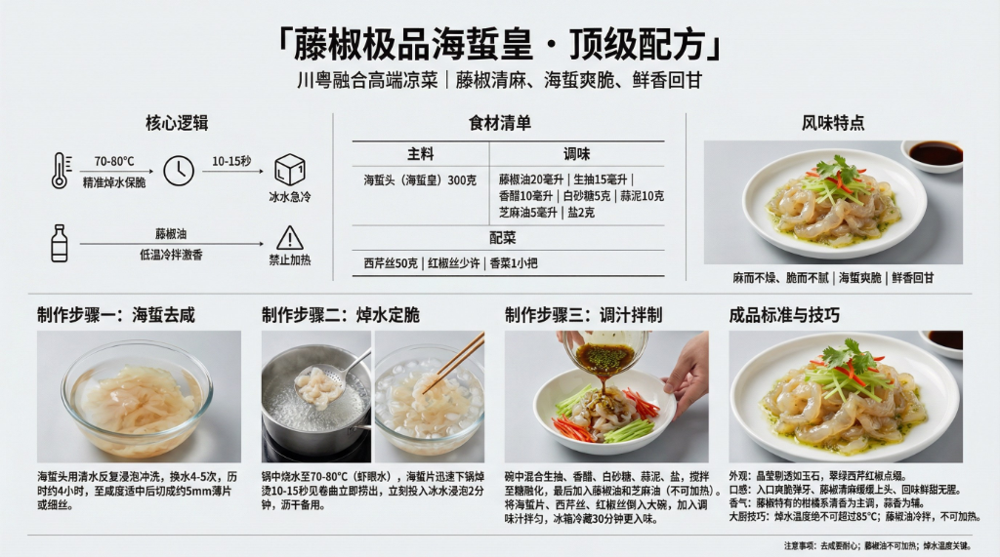

# 《藤椒极品海蜇皇》顶级配方



## 菜品简介

- **菜品来源/流派**：川粤融合，高端凉菜
- **风味特点**：藤椒清麻、海蜇爽脆、鲜香回甘
- **核心逻辑**：海蜇精准焯水保脆 + 藤椒油低温激香，"麻而不燥、脆而不腻"

---

## 食材清单

### 主料
| 食材 | 规格 | 备注 |
|------|------|------|
| 海蜇头（海蜇皇） | 300克 | 选肉质厚实、色泽透亮者 |

### 调味
| 调料 | 用量 | 备注 |
|------|------|------|
| 藤椒油 | 20毫升 | 灵魂调料，不可高温加热 |
| 生抽 | 15毫升 | 提鲜 |
| 香醋 | 10毫升 | 增酸提味 |
| 白砂糖 | 5克 | 提鲜平衡 |
| 蒜泥 | 10克 | 增香 |
| 芝麻油 | 5毫升 | 增润 |
| 盐 | 2克 | 微调 |

### 配菜
| 食材 | 用量 | 备注 |
|------|------|------|
| 西芹 | 50克 | 切细丝，增加清脆口感 |
| 红椒丝 | 少许 | 增色 |
| 香菜 | 1小把 | 切段，点缀增香 |

---

## 制作步骤

### 第一阶段：海蜇去咸
1. 海蜇头用清水反复浸泡冲洗，**换水4-5次**，历时约4小时。
2. 至咸度适中（尝一小块，微咸即可）。
3. 切成约5mm的均匀薄片或细丝。

### 第二阶段：焯水定脆
1. 锅中烧水至**70-80°C**（锅底冒密集小泡但不沸腾）。
2. 海蜇片迅速下锅，**焯烫10-15秒**，见卷曲立即捞出。
3. **立刻投入冰水**浸泡2分钟，急速降温恢复爽脆。
4. 沥干水分备用。

### 第三阶段：调汁拌制
1. 碗中混合生抽、香醋、白砂糖、蒜泥、盐，搅拌至糖融化。
2. **最后加入藤椒油和芝麻油**（不可加热）。
3. 将海蜇片、西芹丝、红椒丝放入大碗，倒入调味汁拌匀。
4. 冰箱冷藏30分钟更入味。

---

## ⚠️ 注意事项

1. **焯水温度绝不可超过85°C**：沸水会让海蜇瞬间缩水变硬变小，口感全毁。
2. **藤椒油不可加热**：藤椒油的清麻香气极易挥发，加热10秒以上香气尽失。永远在最后一步冷拌时加入。
3. **去咸要耐心**：海蜇含盐量极高，泡不够咸到无法入口，泡过了则没有味道。

---

## 💡 大厨技巧

1. **"虾眼水"焯海蜇**：与白灼虾同理，70-80°C的"虾眼水"是焯海蜇的最佳温度。
2. **藤椒油自制更香**：优质青花椒50g放入200ml菜籽油中，60°C低温浸泡2小时，过滤即得。
3. **冰镇让口感升级**：冷藏后的海蜇比常温版爽脆度提升一个档次。

---

## 🎯 成品标准

- **外观**：海蜇片晶莹剔透如玉石，配以翠绿西芹丝、红椒丝点缀。
- **口感**：入口爽脆弹牙、藤椒清麻缓缓上头、回味鲜甜无腥。
- **香气**：藤椒特有的柑橘系清香为主调，蒜香为辅。

---

# 生图提示词（风格C · 现代写实风）

```
A modern, realistic culinary infographic poster,
presenting the complete professional recipe of
《藤椒极品海蜇皇 · 顶级配方》.

OVERALL STYLE:
High-end modern culinary editorial combined with professional cooking instruction.
Clean, precise, realistic, restrained.
Feels like a culinary institute teaching board or Michelin test kitchen manual.
Educational clarity is the primary goal.

LANGUAGE & TEXT QUALITY (ABSOLUTE PRIORITY):
All text must be in standard simplified Chinese only.
High-definition, print-quality Chinese characters.
No traditional Chinese.
No misspellings.
No incorrect or distorted characters.
No pseudo-text.

IMPORTANT TEXT RULES:
All text must be rendered as natural printed book text.
Do NOT display any markdown symbols or formatting characters.
Do NOT show characters such as:
#, ##, ###, -, *, |, >, ``` or bullet symbols.
Section hierarchy must be expressed through layout, spacing, font size, and alignment only.

If needed, rewrite structured content into clean natural language paragraphs or aligned tables.

BACKGROUND:
Clean neutral background with subtle texture
(light warm gray or off-white).
Soft even studio lighting.
No patterns, no decorative backgrounds.
High contrast for long readable text.

TYPOGRAPHY:
Main title in modern, bold, highly legible Chinese typography.
Section titles in slightly larger or heavier font weight.
Body text in clean professional Chinese type.
Comfortable line spacing for dense instructional content.
Tables must be clean, aligned, and grid-based without ASCII characters.

LAYOUT STRUCTURE (CRITICAL):
Aspect ratio 16:9.
Double-row horizontal layout with clear blank space separating rows.
Strict grid system.
Visual separation achieved through spacing and alignment, not symbols.

UPPER ROW CONTENT (VISUAL SECTIONS):
Introduction: 川粤融合高端凉菜，藤椒清麻、海蜇爽脆、鲜香回甘.
Ingredients: 海蜇头300g、藤椒油20ml、生抽15ml、香醋10ml、蒜泥、西芹丝.
Core Logic: 70-80°C焯水10-15秒保脆 + 冰水急冷 + 藤椒油冷拌不加热.

LOWER ROW CONTENT (VISUAL SECTIONS):
Step 1: 海蜇清水浸泡换水4-5次去咸，约4小时.
Step 2: 70-80°C虾眼水焯烫10-15秒，卷曲即捞，冰水定脆.
Step 3: 藤椒油+生抽+香醋冷拌，冰箱冷藏30分钟入味.
Standard: 晶莹剔透如玉石、爽脆弹牙、藤椒柑橘系清麻.

IMAGERY (REALISTIC, EDUCATIONAL):
High-quality realistic food photography:
translucent jellyfish slices glistening with green Sichuan peppercorn oil,
jade-green celery shreds and bright red pepper garnish,
small dish of dark dressing nearby,
white ceramic plate on neutral background.
Images must support understanding, not distract.

GRAPHIC ELEMENTS (FUNCTIONAL ONLY):
Minimal modern diagrams:
temperature gauge icon (70-80°C),
time indicator (10-15sec blanch),
process flow arrows.
Flat, technical style.
No decorative icons.

COLOR SYSTEM:
Neutral professional palette:
black, dark gray, warm gray, off-white.
One green accent color for emphasis only.
No bright or playful colors.

STRICT EXCLUSIONS:
No markdown characters.
No bullet symbols.
No decorative-only graphics.
No cultural motifs.
No cluttered collage.
No illegible characters.

FINAL RULE:
Render the content exactly like a professionally typeset cookbook page,
not a markdown document or note file.

--ar 16:9 --v 6.1 --q 2 高清简体中文
```
