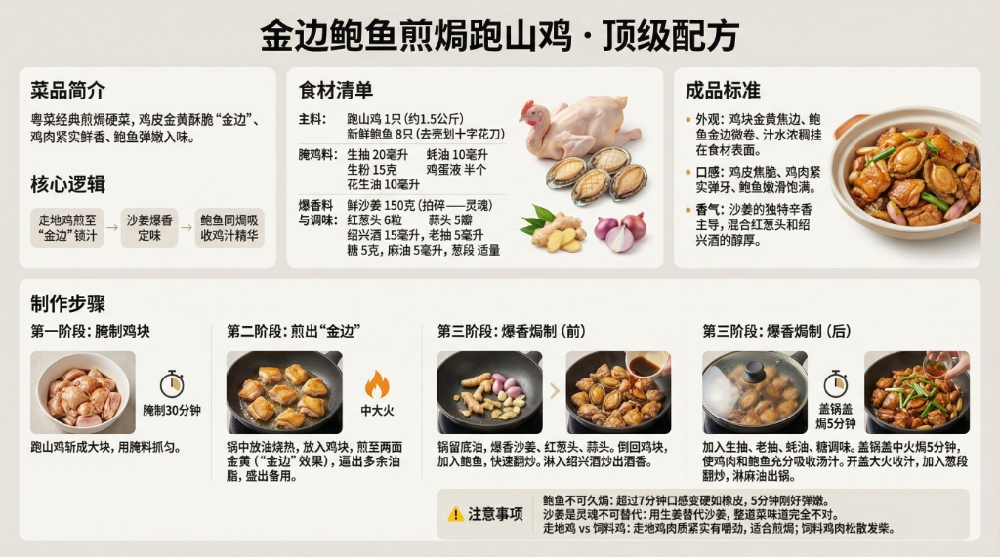

# 《金边鲍鱼煎焗跑山鸡》顶级配方



## 菜品简介
- **菜品来源/流派**：粤菜经典煎焗，高端硬菜
- **风味特点**：鸡皮金黄酥脆（"金边"）、鸡肉紧实鲜香、鲍鱼弹嫩入味
- **核心逻辑**：走地鸡煎至"金边"锁汁 + 沙姜爆香定味 + 鲍鱼同焗吸收鸡汁精华

---

## 食材清单
### 主料
| 食材 | 规格 | 备注 |
|------|------|------|
| 跑山鸡（走地鸡） | 1只（约1.5公斤） | 斩块，鸡味浓郁 |
| 新鲜鲍鱼 | 8只 | 去壳洗净，表面划十字花刀 |

### 腌鸡料
| 调料 | 用量 | 备注 |
|------|------|------|
| 生抽 | 20毫升 | 调味 |
| 蚝油 | 10毫升 | 提鲜 |
| 生粉 | 15克 | 嫩滑锁汁 |
| 鸡蛋液 | 半个 | 增嫩上色 |
| 花生油 | 10毫升 | 封住水分 |

### 爆香料与调味
| 食材 | 用量 | 备注 |
|------|------|------|
| 鲜沙姜 | 150克 | 去皮拍碎——此菜灵魂 |
| 红葱头 | 6粒 | 拍扁 |
| 蒜头 | 5瓣 | 拍扁 |
| 绍兴酒 | 15毫升 | 去腥增香 |
| 老抽 | 5毫升 | 上色 |
| 糖 | 5克 | 提味 |
| 麻油 | 5毫升 | 出锅前淋 |
| 葱段 | 适量 | 最后加入 |

---

## 制作步骤

### 第一阶段：腌制鸡块
1. 跑山鸡斩成大块，用腌料抓匀，**腌制30分钟**。

### 第二阶段：煎出"金边"
1. 锅中放适量油烧热，放入腌好的鸡块。
2. **中大火煎至两面金黄**（"金边"效果），逼出多余油脂。
3. 煎好盛出备用。

### 第三阶段：爆香焗制
1. 锅中留底油，放入沙姜碎、红葱头、蒜头爆香。
2. 倒回煎好的鸡块，加入鲍鱼，快速翻炒。
3. 淋入绍兴酒，炒出酒香。
4. 加入生抽、老抽、蚝油、糖调味。
5. **盖锅盖中火焗5分钟**，使鸡肉和鲍鱼充分吸收汤汁。
6. 开盖大火收汁，加入葱段翻炒，淋麻油出锅。

---

## ⚠️ 注意事项
1. **鲍鱼不可久焗**：鲍鱼超过7分钟口感变硬如橡皮，5分钟刚好弹嫩。
2. **沙姜是灵魂不可替代**：用生姜替代沙姜，整道菜味道完全不对。
3. **走地鸡 vs 饲料鸡**：走地鸡肉质紧实有嚼劲，适合煎焗；饲料鸡肉松散发柴。

---

## 🎯 成品标准
- **外观**：鸡块金黄焦边、鲍鱼金边微卷、汁水浓稠挂在食材表面。
- **口感**：鸡皮焦脆、鸡肉紧实弹牙、鲍鱼嫩滑饱满。
- **香气**：沙姜的独特辛香主导，混合红葱头和绍兴酒的醇厚。

---

# 生图提示词（风格C · 现代写实风）

```
A modern, realistic culinary infographic poster,
presenting the complete professional recipe of
《金边鲍鱼煎焗跑山鸡 · 顶级配方》.

OVERALL STYLE:
High-end modern culinary editorial combined with professional cooking instruction.
Clean, precise, realistic, restrained.
Feels like a culinary institute teaching board or Michelin test kitchen manual.
Educational clarity is the primary goal.

LANGUAGE & TEXT QUALITY (ABSOLUTE PRIORITY):
All text must be in standard simplified Chinese only.
High-definition, print-quality Chinese characters.
No traditional Chinese. No misspellings. No incorrect or distorted characters. No pseudo-text.

IMPORTANT TEXT RULES:
All text must be rendered as natural printed book text.
Do NOT display any markdown symbols or formatting characters.
Do NOT show characters such as: #, ##, ###, -, *, |, >, ``` or bullet symbols.
Section hierarchy must be expressed through layout, spacing, font size, and alignment only.
If needed, rewrite structured content into clean natural language paragraphs or aligned tables.

BACKGROUND:
Clean neutral background with subtle texture (light warm gray or off-white).
Soft even studio lighting. No patterns, no decorative backgrounds. High contrast for long readable text.

TYPOGRAPHY:
Main title in modern, bold, highly legible Chinese typography.
Section titles in slightly larger or heavier font weight.
Body text in clean professional Chinese type.
Comfortable line spacing for dense instructional content.
Tables must be clean, aligned, and grid-based without ASCII characters.

LAYOUT STRUCTURE (CRITICAL):
Aspect ratio 16:9. Double-row horizontal layout with clear blank space separating rows.
Strict grid system. Visual separation achieved through spacing and alignment, not symbols.

UPPER ROW CONTENT (VISUAL SECTIONS):
Introduction: 粤菜经典煎焗硬菜，鸡皮金黄酥脆"金边"、鲍鱼弹嫩.
Ingredients: 跑山鸡1只1.5kg、鲜鲍鱼8只、鲜沙姜150g、红葱头6粒.
Core Logic: 走地鸡煎至金边锁汁 + 沙姜爆香定味 + 鲍鱼同焗吸鸡汁精华.

LOWER ROW CONTENT (VISUAL SECTIONS):
Step 1: 鸡块腌制30分钟（生抽、蚝油、生粉、蛋液）.
Step 2: 中大火煎至两面金黄"金边"，逼出油脂.
Step 3: 沙姜、红葱头、蒜头爆香，加鲍鱼翻炒.
Step 4: 绍兴酒调味，盖锅焗5分钟，大火收汁淋麻油.

IMAGERY (REALISTIC, EDUCATIONAL):
High-quality realistic food photography:
golden-crusted chicken pieces with caramelized edges,
plump abalone with cross-hatch scoring,
fresh sand ginger and shallots as garnish,
thick glossy sauce coating ingredients.
Images must support understanding, not distract.

GRAPHIC ELEMENTS (FUNCTIONAL ONLY):
Minimal modern diagrams: time indicators (30min marinate, 5min braise), heat level markers (medium-high fire icon), process flow arrows. Flat, technical style. No decorative icons.

COLOR SYSTEM:
Neutral professional palette: black, dark gray, warm gray, off-white.
One warm golden accent color for emphasis only. No bright or playful colors.

STRICT EXCLUSIONS:
No markdown characters. No bullet symbols. No decorative-only graphics. No cultural motifs. No cluttered collage. No illegible characters.

FINAL RULE:
Render the content exactly like a professionally typeset cookbook page, not a markdown document or note file.

--ar 16:9 --v 6.1 --q 2 高清简体中文
```
