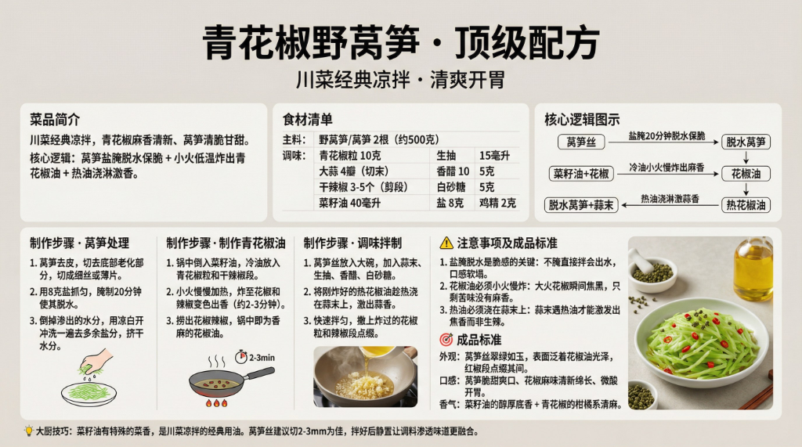

# 《青花椒野莴笋》顶级配方



## 菜品简介

- **菜品来源/流派**：川菜经典凉拌，清爽开胃
- **风味特点**：青花椒麻香清新、莴笋清脆甘甜、层次分明
- **核心逻辑**：莴笋盐腌脱水保脆 + 小火低温炸出青花椒油 + 热油浇淋激香

---

## 食材清单

### 主料
| 食材 | 规格 | 备注 |
|------|------|------|
| 野莴笋/莴笋 | 2根（约500克） | 选嫩绿色、茎部粗壮者，去老皮 |

### 调味
| 调料 | 用量 | 备注 |
|------|------|------|
| 青花椒粒 | 10克 | 干燥者提前凉水泡软，防炸时焦糊 |
| 大蒜 | 4瓣 | 切末 |
| 干辣椒 | 3-5个 | 剪段，可选 |
| 菜籽油 | 40毫升 | 川菜灵魂用油 |
| 生抽 | 15毫升 | 提鲜 |
| 香醋 | 10毫升 | 增酸 |
| 白砂糖 | 5克 | 提鲜 |
| 盐 | 8克 | 腌制脱水用 |
| 鸡精 | 2克 | 可选 |

---

## 制作步骤

### 第一阶段：莴笋处理
1. 莴笋去皮，切去底部老化部分，切成细丝或薄片。
2. 用**8克盐**抓匀，腌制**20分钟**使其脱水。
3. 倒掉渗出的水分，用凉白开冲洗一遍去多余盐分，**挤干水分**。

### 第二阶段：制作青花椒油
1. 锅中倒入菜籽油，**冷油放入**青花椒粒和干辣椒段。
2. **小火慢慢加热**，炸至花椒和辣椒变色出香（约2-3分钟）。
3. 捞出花椒辣椒（保留部分用于点缀），锅中即为香麻的花椒油。

### 第三阶段：调味拌制
1. 莴笋丝放入大碗，加入蒜末、生抽、香醋、白砂糖。
2. 将刚炸好的**热花椒油趁热浇在蒜末上**——"嗞啦"一声激出蒜香。
3. 快速拌匀，撒上炸过的花椒粒和辣椒段点缀。

---

## ⚠️ 注意事项

1. **盐腌脱水是脆感的关键**：不腌直接拌会出水，口感软塌。
2. **花椒油必须小火慢炸**：大火花椒瞬间焦黑，只剩苦味没有麻香。
3. **热油必须浇在蒜末上**：蒜末遇热油才能激发出焦香而非生辣。

---

## 💡 大厨技巧

1. **菜籽油 vs 其他油**：菜籽油有特殊的"菜香"，是川菜凉拌的经典用油。用花生油或色拉油做出来就差了一个档次。
2. **莴笋切丝刀工**：丝越细越入味，建议2-3mm为佳。
3. **静置5分钟再吃**：拌好后静置让调料渗透，味道会更融合。

---

## 🎯 成品标准

- **外观**：莴笋丝翠绿如玉，表面泛着花椒油光泽，红椒段点缀其间。
- **口感**：莴笋脆甜爽口、花椒麻味清新绵长、微酸开胃。
- **香气**：菜籽油的醇厚底香 + 青花椒的柑橘系清麻。

---

# 生图提示词（风格C · 现代写实风）

```
A modern, realistic culinary infographic poster,
presenting the complete professional recipe of
《青花椒野莴笋 · 顶级配方》.

OVERALL STYLE:
High-end modern culinary editorial combined with professional cooking instruction.
Clean, precise, realistic, restrained.
Feels like a culinary institute teaching board or Michelin test kitchen manual.
Educational clarity is the primary goal.

LANGUAGE & TEXT QUALITY (ABSOLUTE PRIORITY):
All text must be in standard simplified Chinese only.
High-definition, print-quality Chinese characters.
No traditional Chinese.
No misspellings.
No incorrect or distorted characters.
No pseudo-text.

IMPORTANT TEXT RULES:
All text must be rendered as natural printed book text.
Do NOT display any markdown symbols or formatting characters.
Do NOT show characters such as:
#, ##, ###, -, *, |, >, ``` or bullet symbols.
Section hierarchy must be expressed through layout, spacing, font size, and alignment only.

If needed, rewrite structured content into clean natural language paragraphs or aligned tables.

BACKGROUND:
Clean neutral background with subtle texture
(light warm gray or off-white).
Soft even studio lighting.
No patterns, no decorative backgrounds.
High contrast for long readable text.

TYPOGRAPHY:
Main title in modern, bold, highly legible Chinese typography.
Section titles in slightly larger or heavier font weight.
Body text in clean professional Chinese type.
Comfortable line spacing for dense instructional content.
Tables must be clean, aligned, and grid-based without ASCII characters.

LAYOUT STRUCTURE (CRITICAL):
Aspect ratio 16:9.
Double-row horizontal layout with clear blank space separating rows.
Strict grid system.
Visual separation achieved through spacing and alignment, not symbols.

UPPER ROW CONTENT (VISUAL SECTIONS):
Introduction: 川菜经典凉拌，青花椒麻香清新、莴笋清脆甘甜.
Ingredients: 莴笋500g、青花椒粒10g、菜籽油40ml、蒜末、干辣椒.
Core Logic: 盐腌20分钟脱水保脆 + 冷油小火炸花椒油 + 热油浇淋激蒜香.

LOWER ROW CONTENT (VISUAL SECTIONS):
Step 1: 莴笋切丝，盐腌20分钟脱水，冲洗挤干.
Step 2: 冷油下花椒粒，小火慢炸2-3分钟出麻香.
Step 3: 热花椒油趁热浇在蒜末上，拌入莴笋丝.
Standard: 翠绿如玉、脆甜爽口、花椒清麻绵长.

IMAGERY (REALISTIC, EDUCATIONAL):
High-quality realistic food photography:
jade-green lettuce stem shreds glistening with peppercorn oil,
dried red chili segments as garnish,
small mortar with green Sichuan peppercorns nearby,
rapeseed oil bottle in background.
Images must support understanding, not distract.

GRAPHIC ELEMENTS (FUNCTIONAL ONLY):
Minimal modern diagrams:
time indicators (20min salt cure, 2-3min fry),
heat level markers (small fire icon),
process flow arrows.
Flat, technical style.
No decorative icons.

COLOR SYSTEM:
Neutral professional palette:
black, dark gray, warm gray, off-white.
One green accent color for emphasis only.
No bright or playful colors.

STRICT EXCLUSIONS:
No markdown characters.
No bullet symbols.
No decorative-only graphics.
No cultural motifs.
No cluttered collage.
No illegible characters.

FINAL RULE:
Render the content exactly like a professionally typeset cookbook page,
not a markdown document or note file.

--ar 16:9 --v 6.1 --q 2 高清简体中文
```
