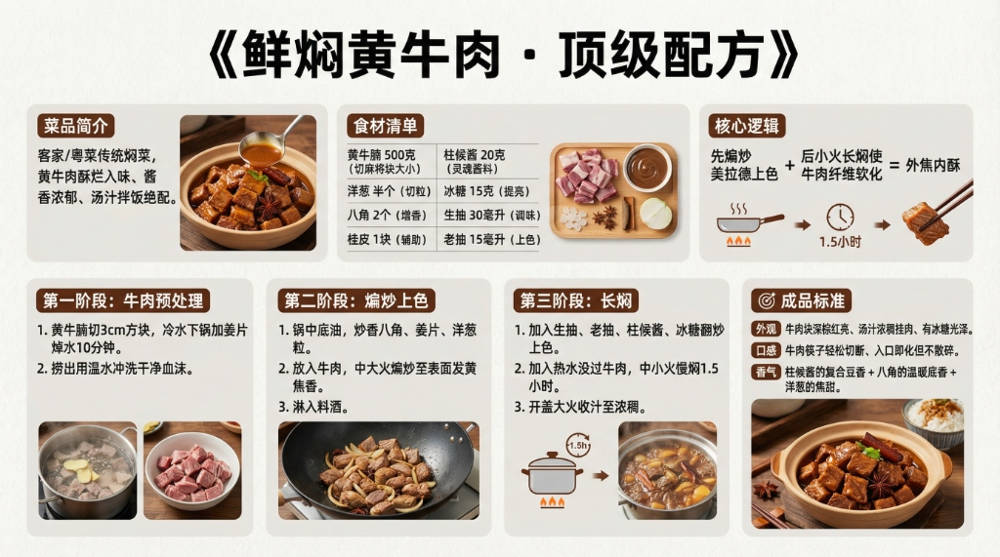

# 《鲜焖黄牛肉》顶级配方



## 菜品简介
- **菜品来源/流派**：客家/粤菜，家常硬菜
- **风味特点**：牛肉酥烂入味、酱香浓郁、汤汁拌饭绝配
- **核心逻辑**：先煸炒美拉德上色 + 后小火长焖使牛肉纤维软化 = 外焦内酥

---

## 食材清单
### 主料
| 食材 | 规格 | 备注 |
|------|------|------|
| 黄牛腩 | 500克 | 选肥瘦相间的部位，切麻将块大小 |

### 辅料与调味
| 调料 | 用量 | 备注 |
|------|------|------|
| 老姜 | 30克 | 切片 |
| 八角 | 2个 | 增香 |
| 香叶 | 3片 | 辅助香料 |
| 小茴香 | 2克 | 可选 |
| 洋葱 | 半个 | 切粒，煸出甜味 |
| 生抽 | 30毫升 | 调味 |
| 老抽 | 15毫升 | 上色 |
| 柱候酱 | 20克 | 粤菜焖牛肉灵魂酱料 |
| 冰糖 | 15克 | 提亮增色 |
| 料酒 | 20毫升 | 去膻 |
| 盐 | 适量 | 后段调味 |
| 热水 | 适量 | 没过牛肉 |
| 土豆 | 1个 | 可选，最后30分钟加入 |

---

## 制作步骤

### 第一阶段：牛肉预处理
1. 黄牛腩切3cm方块，冷水下锅加姜片焯水10分钟。
2. 捞出用温水冲洗干净血沫。

### 第二阶段：煸炒上色
1. 锅中少量底油，放入八角、姜片炒香。
2. 加入洋葱粒煸炒至金黄出甜味。
3. 放入牛肉块，**中大火煸炒至表面发黄**（美拉德反应产生焦香）。
4. 淋入料酒，继续翻炒至酒气挥发。

### 第三阶段：长焖
1. 加入生抽、老抽、柱候酱、冰糖翻炒上色。
2. 加入热水没过牛肉，加入香叶、小茴香。
3. 大火烧开后转**小火慢焖1.5小时**。
4. 如加土豆，最后30分钟放入，加盐调味。
5. 开盖大火收汁至浓稠。

---

## ⚠️ 注意事项
1. **焯水必须冷水下锅**：热水下锅会使牛肉表面蛋白质瞬间收缩，血沫锁在内部排不出来。
2. **加热水不加冷水**：焖煮中途加冷水会让肉质骤然收紧，从软烂变成嚼不动。
3. **柱候酱是粤式焖牛肉的灵魂**：它是豆酱+蒜+芝麻+五香的复合酱，不是简单酱油能替代的。

---

## 🎯 成品标准
- **外观**：牛肉块深棕红亮、汤汁浓稠挂肉、有冰糖光泽。
- **口感**：牛肉用筷子能轻松切断、入口即化但不散碎。
- **香气**：柱候酱的复合豆香 + 八角的温暖底香 + 洋葱的焦甜。

---

# 生图提示词（风格C · 现代写实风）

```
A modern, realistic culinary infographic poster,
presenting the complete professional recipe of
《鲜焖黄牛肉 · 顶级配方》.

OVERALL STYLE:
High-end modern culinary editorial combined with professional cooking instruction.
Clean, precise, realistic, restrained.
Feels like a culinary institute teaching board or Michelin test kitchen manual.
Educational clarity is the primary goal.

LANGUAGE & TEXT QUALITY (ABSOLUTE PRIORITY):
All text must be in standard simplified Chinese only.
High-definition, print-quality Chinese characters.
No traditional Chinese. No misspellings. No incorrect or distorted characters. No pseudo-text.

IMPORTANT TEXT RULES:
All text must be rendered as natural printed book text.
Do NOT display any markdown symbols or formatting characters.
Do NOT show characters such as: #, ##, ###, -, *, |, >, ``` or bullet symbols.
Section hierarchy must be expressed through layout, spacing, font size, and alignment only.
If needed, rewrite structured content into clean natural language paragraphs or aligned tables.

BACKGROUND:
Clean neutral background with subtle texture (light warm gray or off-white).
Soft even studio lighting. No patterns, no decorative backgrounds. High contrast for long readable text.

TYPOGRAPHY:
Main title in modern, bold, highly legible Chinese typography.
Section titles in slightly larger or heavier font weight.
Body text in clean professional Chinese type.
Comfortable line spacing for dense instructional content.
Tables must be clean, aligned, and grid-based without ASCII characters.

LAYOUT STRUCTURE (CRITICAL):
Aspect ratio 16:9. Double-row horizontal layout with clear blank space separating rows.
Strict grid system. Visual separation achieved through spacing and alignment, not symbols.

UPPER ROW CONTENT (VISUAL SECTIONS):
Introduction: 客家/粤菜传统焖菜，黄牛肉酥烂入味、酱香浓郁.
Ingredients: 黄牛腩500g、柱候酱20g、洋葱半个、八角2个、桂皮1块、冰糖15g.
Core Logic: 大块焯水锁血水 + 煸炒美拉德上色 + 小火慢焖1.5小时至筷子穿透.

LOWER ROW CONTENT (VISUAL SECTIONS):
Step 1: 牛腩切3cm方块，冷水焯水10分钟去血沫.
Step 2: 洋葱、姜蒜、八角炒香，加柱候酱和生抽翻炒上色.
Step 3: 加热水没过牛肉，小火焖1.5小时至筷子轻松穿透.
Standard: 牛肉深棕红亮、入口即化、柱候酱复合豆香+洋葱焦甜.

IMAGERY (REALISTIC, EDUCATIONAL):
High-quality realistic food photography:
dark amber braised beef cubes in thick glossy sauce,
star anise and cinnamon visible in the stew,
clay pot with steam rising,
onion wedges as accompaniment.
Images must support understanding, not distract.

GRAPHIC ELEMENTS (FUNCTIONAL ONLY):
Minimal modern diagrams: time indicators (1.5h braise), heat level markers (small fire icon), process flow arrows. Flat, technical style. No decorative icons.

COLOR SYSTEM:
Neutral professional palette: black, dark gray, warm gray, off-white.
One deep brown accent color for emphasis only. No bright or playful colors.

STRICT EXCLUSIONS:
No markdown characters. No bullet symbols. No decorative-only graphics. No cultural motifs. No cluttered collage. No illegible characters.

FINAL RULE:
Render the content exactly like a professionally typeset cookbook page, not a markdown document or note file.

--ar 16:9 --v 6.1 --q 2 高清简体中文
```
